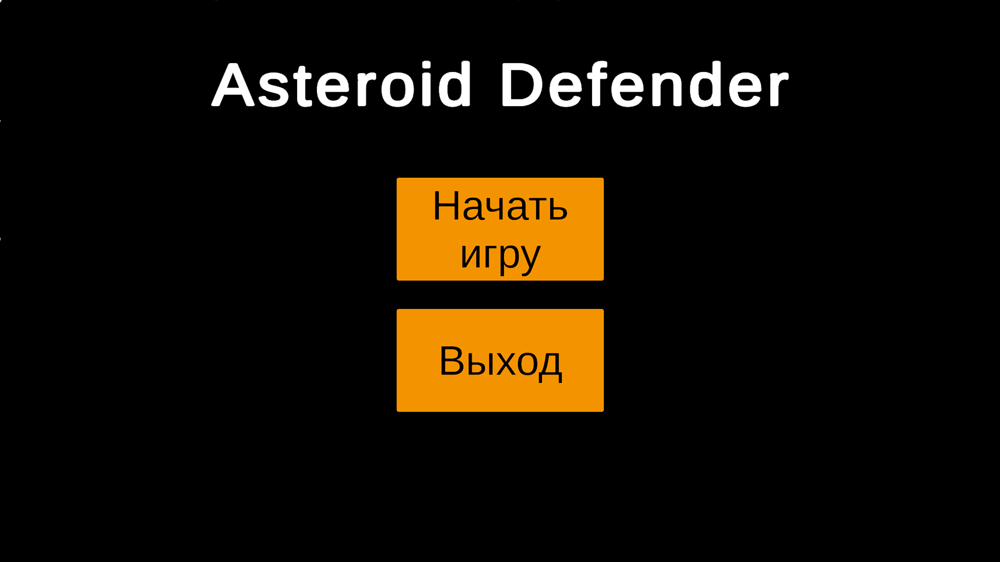
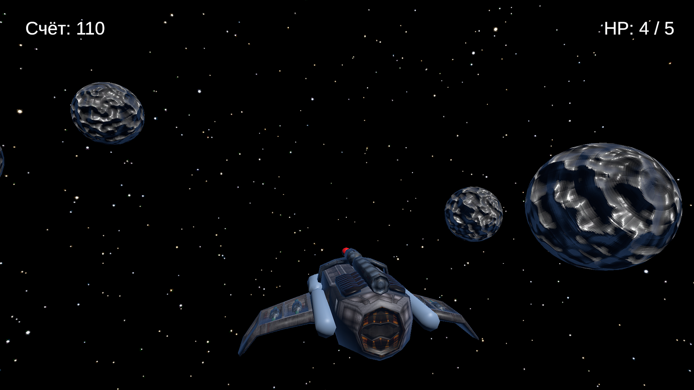

# Asteroid Defender

Защита космической станции от метеоритных волн

<ul>
  <li>PC (Windows)</li>
  <li>Landscape orientation (Горизонтальная ориентация)</li>
  <li>Unity 6.4</li>
</ul>

## Концепт
**Asteroid Defender** — это 3D-шутер от третьего лица с фиксированной камерой (вид сверху). Игрок берет на себя роль оператора защитного орудия на космической станции, находящейся в открытом космосе. 

Главная задача игрока — отбивать нарастающие волны метеоритов, летящих к станции, и не дать ей разрушиться. За каждый уничтоженный астероид начисляются очки. В процессе игры игрока сопровождает сюжетная линия (narrative text), погружающая в атмосферу космической угрозы. Если метеорит достигает станции — она теряет очки прочности (HP). Чем дольше игрок выживает, тем плотнее и сложнее становится поток метеоритов.

## Визуальный стиль
Источниками вдохновения для механик и визуала послужили классические космические аркады, перенесенные в 3D-пространство с современными эффектами.

Камера зафиксирована сверху, обеспечивая полный тактический обзор станции и надвигающейся угрозы.

## Жизненный цикл
1. Запуск игры. Открывается Главное меню с кнопками **«Начать игру»** и **«Выход»**.
2. При нажатии «Начать игру» происходит переход на игровой уровень. Появляется интерфейс: HP станции, счетчик очков и повествовательный текст.
3. Основной геймплей: игрок целится мышью и стреляет по метеоритам, отбивая волны.
4. При нажатии на пробел (`Space`) игра ставится на паузу. Открывается Панель паузы с кнопками: **«Продолжить»**, **«В главное меню»**, **«Выход»**.
5. Если HP станции падает до нуля, игра заканчивается.
6. Появляется Финальное меню (экран поражения/результатов) с кнопками **«В главное меню»** и **«Выход»**.

## Механики и особенности

### <u>Core mechanics:</u>
* **Управление орудием:** Игрок целится с помощью мыши и совершает выстрелы кликом.
* **Разрушение метеоритов:** При попадании снаряда метеорит разрушается. Уничтожение сопровождается проигрыванием визуальных эффектов (VFX частиц) и звука взрыва.
* **Стрельба:** Процесс выстрела также имеет собственное звуковое сопровождение.
* **Система волн:** Поток астероидов не статичен — со временем интенсивность появления метеоритов нарастает.
* **Система повреждений:** Столкновение метеорита со станцией отнимает у нее очки здоровья (HP).
* **Счетчик очков:** Начисление очков происходит в реальном времени за каждый успешно сбитый космический объект.

### <u>UI & Narrative:</u>
* Непрерывное отображение текущего состояния (HP и очки).
* Повествовательные текстовые элементы, интегрированные в UI прямо во время защиты станции.

### <u>Технологии и оптимизация:</u>
* **Запекание освещения (Baked Lighting):** Для оптимизации рендеринга и снижения количества Draw Calls освещение на игровом уровне заранее просчитано (запечено). В качестве неподвижного объекта, на который запекался свет, выступает сама космическая станция. Это позволяет разгрузить систему при генерации большого числа динамических объектов (метеоритов и выстрелов).

## Сборка (Build)

Сборку проекта под ПК (Windows) можно скачать по ссылке ниже:

<a href="">Сборка под Windows</a>

## Видео-демонстрация (Demonstration video)
<a href="">Ссылка на видео геймплея</a>

## Инструкция по запуску (Launch instructions)
1. Скачайте архив со сборкой игры по ссылке выше.
2. Распакуйте архив в любую удобную папку на вашем ПК.
3. Запустите исполняемый файл `AsteroidDefender.exe`.
4. В главном меню нажмите «Начать игру», цельтесь мышкой и стреляйте левой кнопкой! (Для паузы используйте клавишу `Space`).